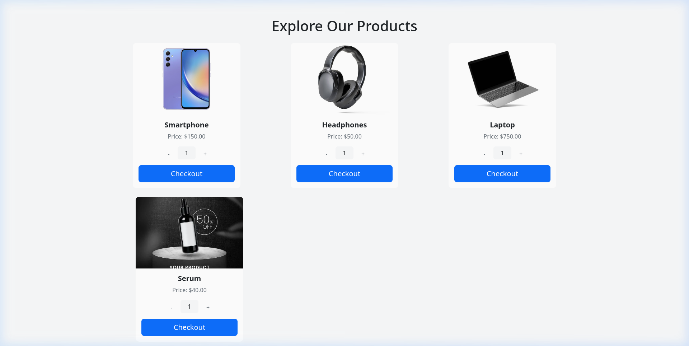
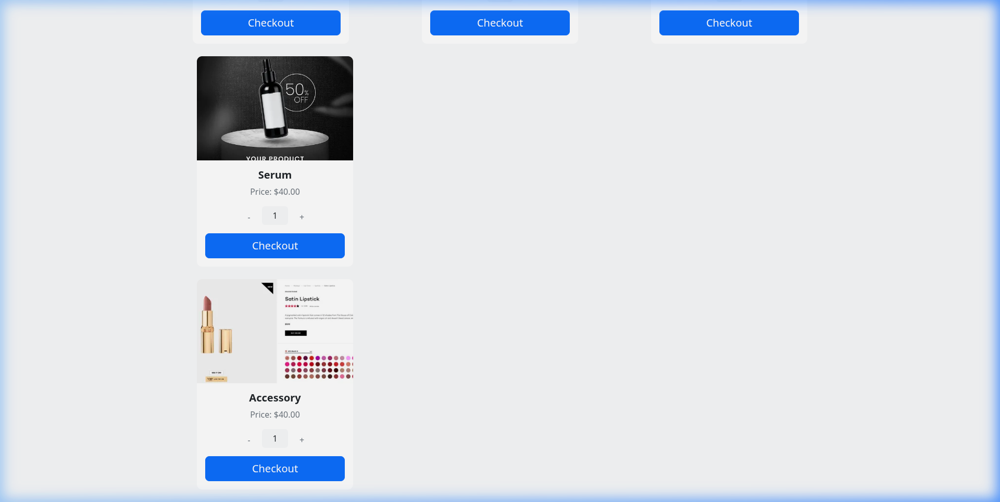
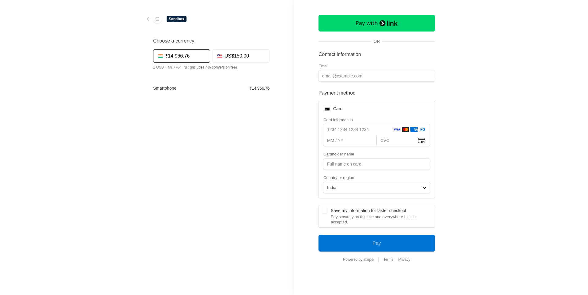
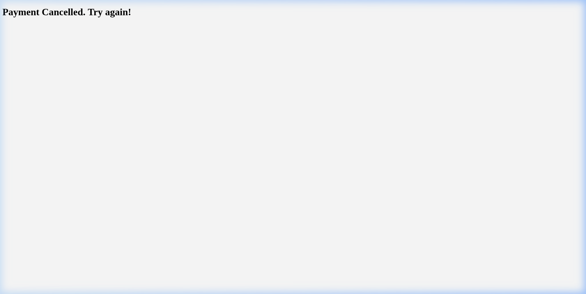

<p align="center">
  
  
  
  
  
  
</p>

<h1 align="center">💳 Stripe Payment Integration</h1>

<p align="center">
  <strong>A production-ready Spring Boot e-commerce payment system with Stripe Checkout integration, Thymeleaf storefront, and Docker deployment support.</strong>
</p>

<p align="center">
  <a href="https://stripepay-spring.up.railway.app/"><b>🌐 Live Demo</b></a> •
  <a href="#-screenshots">Screenshots</a> •
  <a href="#-features">Features</a> •
  <a href="#-architecture">Architecture</a> •
  <a href="#-quick-start">Quick Start</a> •
  <a href="#-api-reference">API Reference</a> •
  <a href="#-deployment">Deployment</a>
</p>

> **🔗 Try it now:** [https://stripepay-spring.up.railway.app](https://stripepay-spring.up.railway.app/) — Browse products, adjust quantities, and test the full Stripe Checkout flow using test card `4242 4242 4242 4242`.

---

## Screenshots

> All screenshots below are captured from the **live deployment** at [stripepay-spring.up.railway.app](https://stripepay-spring.up.railway.app/)

### Product Catalog

> The storefront displays product cards with dynamic quantity controls and one-click checkout buttons.

<p align="center">
  
</p>

<p align="center">
  
</p>

### Stripe Checkout

> Clicking **Checkout** creates a Stripe session and redirects the user to Stripe's hosted payment page with real-time currency conversion.

<p align="center">
  
</p>

### Payment Result Pages

| ✅ Success | ❌ Cancelled |
|:---:|:---:|
|  |  |

---

## ✨ Features

| Category | Details |
|---|---|
| **Stripe Checkout** | Server-side session creation via Stripe Java SDK with redirect-based hosted checkout |
| **Product Storefront** | Thymeleaf-rendered catalog with Bootstrap 5, quantity selectors, and hover animations |
| **Input Validation** | Jakarta Bean Validation on all DTOs (`@NotBlank`, `@Min`) with global exception handling |
| **Security** | Environment-variable config (no hardcoded secrets), CORS policy, non-root Docker user |
| **Health Monitoring** | Spring Boot Actuator with a locked-down `/actuator/health` endpoint |
| **Docker Support** | Multi-stage build, JRE-only runtime, container-aware JVM flags |

---

## 🏗 Architecture

```
stripe-payment-integration-springboot/
│
├── src/main/java/com/gateways/payment/
│   ├── PaymentApplication.java            # Spring Boot entry point
│   ├── config/
│   │   └── WebConfig.java                 # CORS configuration
│   ├── controller/
│   │   ├── HomeController.java            # Page routes (/, /success, /cancel)
│   │   └── CheckoutController.java        # REST API — POST /product/v1/checkout
│   ├── dto/
│   │   ├── ProductReq.java                # Validated request DTO
│   │   └── StripeResponse.java            # API response DTO
│   ├── exception/
│   │   └── GlobalExceptionHandler.java    # Centralized error handling
│   └── service/
│       └── StripeService.java             # Stripe session creation logic
│
├── src/main/resources/
│   ├── application.properties             # Externalized config
│   ├── templates/                         # Thymeleaf HTML pages
│   │   ├── index.html                     # Product catalog storefront
│   │   ├── success.html                   # Payment success page
│   │   └── cancel.html                    # Payment cancelled page
│   └── static/images/                     # Product images
│
├── Dockerfile                             # Multi-stage Docker build
├── .env.example                           # Environment variable template
└── pom.xml                                # Maven dependencies
```

### Request Flow

```
┌──────────┐     POST /product/v1/checkout     ┌───────────────────┐
│          │ ──────────────────────────────────▶│                   │
│  Browser │     { name, amount, quantity }     │  CheckoutController│
│ (index)  │                                   │                   │
│          │◀────────────────────────────────── │                   │
└──────────┘     { sessionId, sessionUrl }      └────────┬──────────┘
     │                                                   │
     │  stripe.redirectToCheckout(sessionId)              │ stripeService.checkoutProducts()
     │                                                   ▼
     │                                          ┌───────────────────┐
     │                                          │                   │
     │                                          │   StripeService   │
     │                                          │                   │
     │                                          └────────┬──────────┘
     │                                                   │
     │                                                   │ Session.create(params)
     │                                                   ▼
     │                                          ┌───────────────────┐
     │         Hosted Checkout Page              │                   │
     └─────────────────────────────────────────▶│   Stripe API      │
                                                │                   │
               /success  or  /cancel            └───────────────────┘
     ◀──────────────────────────────────────────
```

---

## 🚀 Quick Start

### Prerequisites

- **Java 21** (or later)
- **Maven 3.9+** (or use the included `mvnw` wrapper)
- **Stripe Account** — [Sign up free](https://dashboard.stripe.com/register)

### 1. Clone the Repository

```bash
git clone https://github.com/PriyamJaiswal/stripe-payment-integration-springboot.git
cd stripe-payment-integration-springboot
```

### 2. Configure Environment Variables

```bash
cp .env.example .env
```

Edit `.env` with your Stripe credentials:

```env
STRIPE_SECRET_KEY=sk_test_your_key_here
SERVER_PORT=8080
APP_BASE_URL=http://localhost:8080
```

> **💡 Tip:** Get your test keys from the [Stripe Dashboard → Developers → API Keys](https://dashboard.stripe.com/test/apikeys).

### 3. Run the Application

```bash
# Using Maven wrapper
./mvnw spring-boot:run

# Or with environment variables inline
STRIPE_SECRET_KEY=sk_test_... SERVER_PORT=8080 APP_BASE_URL=http://localhost:8080 ./mvnw spring-boot:run
```

### 4. Open in Browser

```
http://localhost:8080
```

Select a product, adjust quantity, and click **Checkout** to be redirected to Stripe's hosted payment page.

> **🧪 Test Card:** Use `4242 4242 4242 4242` with any future expiry and any CVC.

---

## 📡 API Reference

### Create Checkout Session

```http
POST /product/v1/checkout
Content-Type: application/json
```

**Request Body:**

```json
{
  "name": "Smartphone",
  "amount": 15000,
  "quantity": 1,
  "currency": "usd"
}
```

| Field | Type | Required | Description |
|---|---|---|---|
| `name` | `string` | ✅ | Product name |
| `amount` | `long` | ✅ | Price in **cents** (e.g., `15000` = $150.00) |
| `quantity` | `long` | ✅ | Quantity (minimum 1) |
| `currency` | `string` | ❌ | ISO currency code (defaults to `usd`) |

**Success Response** `200 OK`:

```json
{
  "status": "SUCCESS",
  "message": "Payment session created successfully",
  "sessionId": "cs_test_...",
  "sessionUrl": "https://checkout.stripe.com/c/pay/..."
}
```

**Error Response** `400 Bad Request` (validation failure):

```json
{
  "status": "FAILED",
  "message": "name: Product name is required, amount: Amount must be at least 1 cent"
}
```

**Error Response** `500 Internal Server Error` (Stripe API failure):

```json
{
  "status": "FAILED",
  "message": "Payment session creation failed: Invalid API Key provided"
}
```

---

## 🐳 Deployment

### Railway (Live)

This project is deployed and running on **Railway**:

🔗 **https://stripepay-spring.up.railway.app/**

To deploy your own instance on Railway:

1. Fork this repository
2. Create a new project on [Railway](https://railway.app/)
3. Connect your GitHub repository
4. Add the following environment variables in the Railway dashboard:

   | Variable | Value |
   |---|---|
   | `STRIPE_SECRET_KEY` | `sk_test_your_key_here` |
   | `SERVER_PORT` | `8080` |
   | `APP_BASE_URL` | `https://your-app.up.railway.app` |

5. Railway will auto-detect the `Dockerfile` and deploy

---

### Docker

```bash
# Build the image
docker build -t stripe-payment-app .

# Run the container
docker run -d \
  -p 8080:8080 \
  -e STRIPE_SECRET_KEY=sk_test_your_key \
  -e SERVER_PORT=8080 \
  -e APP_BASE_URL=http://localhost:8080 \
  --name stripe-app \
  stripe-payment-app
```

The Dockerfile uses a **multi-stage build** to minimize image size:

| Stage | Base Image | Purpose |
|---|---|---|
| Build | `maven:3.9-eclipse-temurin-21` | Compile & package the JAR |
| Runtime | `eclipse-temurin:21-jre` | Run with JRE only (~200 MB) |

Security: the container runs as a **non-root** `appuser` with container-aware JVM memory flags.

---

## 🛠 Tech Stack

| Layer | Technology |
|---|---|
| **Runtime** | Java 21, Spring Boot 3.5.7 |
| **Web** | Spring MVC, Thymeleaf, Bootstrap 5 |
| **Payments** | Stripe Java SDK 24.6.0 |
| **Validation** | Jakarta Bean Validation (Hibernate Validator) |
| **Build** | Maven, Lombok |
| **Monitoring** | Spring Boot Actuator |
| **Containerization** | Docker (multi-stage) |

---

## 📁 Environment Variables

| Variable | Required | Default | Description |
|---|---|---|---|
| `STRIPE_SECRET_KEY` | ✅ | — | Your Stripe secret key (`sk_test_...` or `sk_live_...`) |
| `SERVER_PORT` | ❌ | `8080` | Application server port |
| `APP_BASE_URL` | ❌ | `http://localhost:8080` | Base URL for Stripe success/cancel redirects |

---

## 🤝 Contributing

1. Fork the repository
2. Create a feature branch (`git checkout -b feature/amazing-feature`)
3. Commit your changes (`git commit -m 'Add amazing feature'`)
4. Push to the branch (`git push origin feature/amazing-feature`)
5. Open a Pull Request

---

## 📄 License

This project is open source and available under the [MIT License](LICENSE).

---

<p align="center">
  Built with ❤️ by <a href="https://github.com/PriyamJaiswal">Priyam Jaiswal</a>
</p>
