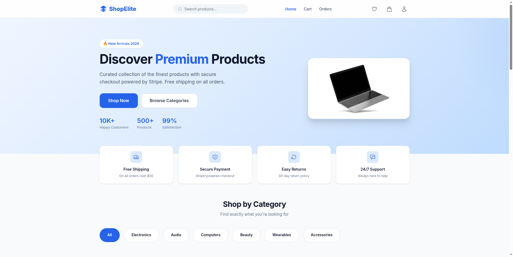
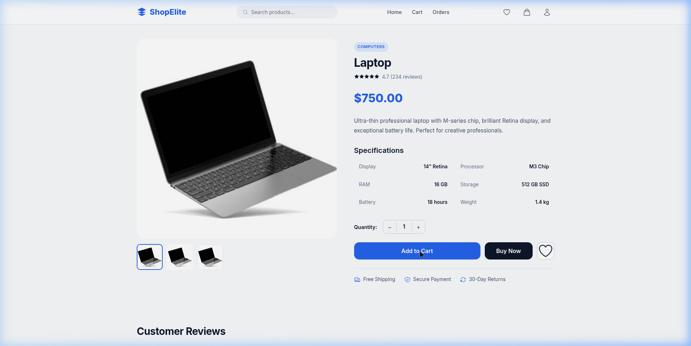
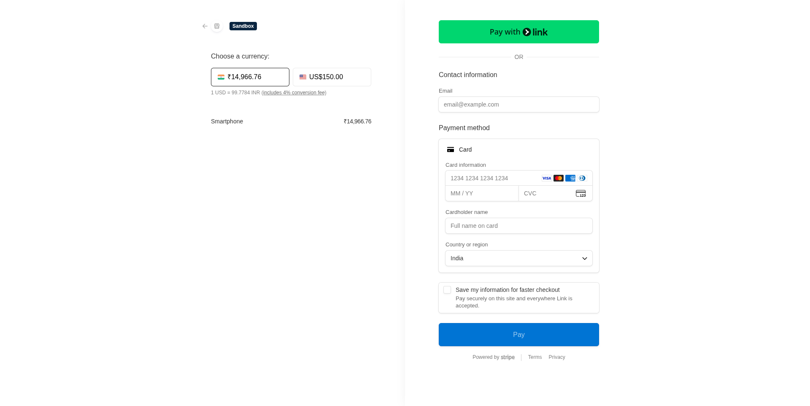

<p align="center">
  
  
  
  
  
</p>

<h1 align="center">🛒 Cartly — Modern E-Commerce Platform & Stripe Checkout</h1>

<p align="center">
  <strong>A premium, responsive full-stack e-commerce frontend integrated with a Spring Boot backend and Stripe Checkout API. Inspired by Apple, Stripe, and Shopify visual design systems.</strong>
</p>

<p align="center">
  <a href="#-screenshots">Screenshots</a> •
  <a href="#-features">Features</a> •
  <a href="#-architecture">Architecture</a> •
  <a href="#-quick-start">Quick Start</a> •
  <a href="#-api-reference">API Reference</a> •
  <a href="#-deployment">Deployment</a>
</p>

---

## 📸 Screenshots

### Storefront & Hero Section
> **Cartly** features a modern, clean typography layout, soft micro-interactions, category filter pills, and product catalog showcase.

<p align="center">
  
</p>

### Product Detail & Reviews Page
> Dedicated product views with specs, customer ratings, image previews, wishlist toggle, and instant cart action.

<p align="center">
  
</p>

### Multi-Step Checkout & Stripe Payments
> Professional multi-step checkout workflow (Address selection → Shipping method → Payment mode selection → Stripe redirect).

<p align="center">
  
</p>

### Payment Outcome
| ✅ Order Confirmed | ❌ Payment Cancelled |
|:---:|:---:|
|  |  |

---

## ✨ Key Features

| Category | Highlights |
|---|---|
| **Modern Design System** | Pure CSS system (`design-system.css`) with Apple & Shopify minimal aesthetics, responsive mobile drawer navigation, smooth micro-animations |
| **Complete E-Commerce Flow** | Product catalog, detailed product view, slide-out cart state, multi-step checkout stepper, wishlist, profile, and order history |
| **Stripe Checkout Integration** | Backend session generation (`POST /product/v1/checkout`) triggering Stripe hosted checkout redirect |
| **Local Storage State Engine** | Modular JS store (`store.js`) handling cart management, address CRUD operations, wishlist toggles, and saved orders |
| **Flexible Payment Choices** | Supports 6 payment selection UI flows (Card, UPI, Net Banking, Wallet, COD, EMI) |
| **Spring Boot Backend** | Spring Boot 3.5.7 with Java 21, REST APIs, Thymeleaf view controllers, and bean validation |

---

## 🏗 Architecture & File Layout

```
stripe-payment-integration-springboot/
│
├── src/main/java/com/gateways/payment/
│   ├── PaymentApplication.java            # Spring Boot main entry
│   ├── config/
│   │   └── WebConfig.java                 # Web & CORS configuration
│   ├── controller/
│   │   ├── HomeController.java            # Routes (/, /cart, /checkout, /orders, /profile, /wishlist, /success, /cancel)
│   │   └── CheckoutController.java        # REST API — POST /product/v1/checkout
│   ├── dto/
│   │   ├── ProductReq.java                # Validated Checkout request DTO
│   │   └── StripeResponse.java            # Stripe session response DTO
│   ├── exception/
│   │   └── GlobalExceptionHandler.java    # Exception handling
│   └── service/
│       └── StripeService.java             # Stripe SDK Session builder logic
│
├── src/main/resources/
│   ├── static/
│   │   ├── css/
│   │   │   └── design-system.css          # Cartly CSS system & animations
│   │   └── js/
│   │       ├── store.js                   # Cart/Address/Order state manager
│   │       └── app.js                     # Shared navbar, footer, toast & Stripe client
│   └── templates/                         # HTML pages
│       ├── index.html                     # Main storefront & catalog
│       ├── product.html                   # Product detail page
│       ├── cart.html                      # Shopping cart page
        ├── checkout.html                  # Multi-step checkout workflow
│       ├── orders.html                    # Order history & status timeline
│       ├── profile.html                   # User profile & address management
│       ├── wishlist.html                  # Saved wishlist products
│       ├── success.html                   # Order confirmation page
│       └── cancel.html                    # Payment cancelled page
│
├── Dockerfile                             # Multi-stage Docker deployment
└── pom.xml                                # Maven build configuration
```

---

## 🚀 Quick Start

### Prerequisites
- **Java 21** or later
- **Maven 3.9+** (or included `./mvnw`)
- **Stripe Account** (for API keys)

### 1. Clone & Configure Environment

```bash
git clone https://github.com/PriyamJaiswal/stripe-payment-integration-springboot.git
cd stripe-payment-integration-springboot
cp .env.example .env
```

Set your keys in `.env`:
```env
STRIPE_SECRET_KEY=sk_test_your_stripe_secret_key
SERVER_PORT=8080
APP_BASE_URL=http://localhost:8080
```

### 2. Run Application

```bash
./mvnw spring-boot:run
```

Access **Cartly** in browser at `http://localhost:8080`

---

## 📡 API Reference

### Create Stripe Checkout Session

```http
POST /product/v1/checkout
Content-Type: application/json
```

**Payload:**
```json
{
  "name": "Smartphone",
  "amount": 75000,
  "quantity": 1,
  "currency": "usd"
}
```

**Response:**
```json
{
  "status": "SUCCESS",
  "message": "Payment session created successfully",
  "sessionId": "cs_test_a1b2c3...",
  "sessionUrl": "https://checkout.stripe.com/c/pay/cs_test_a1b2c3..."
}
```

---

## 📄 License

This project is licensed under the [MIT License](LICENSE).

<p align="center">
  Built with ❤️ by <a href="https://github.com/PriyamJaiswal">Priyam Jaiswal</a>
</p>
